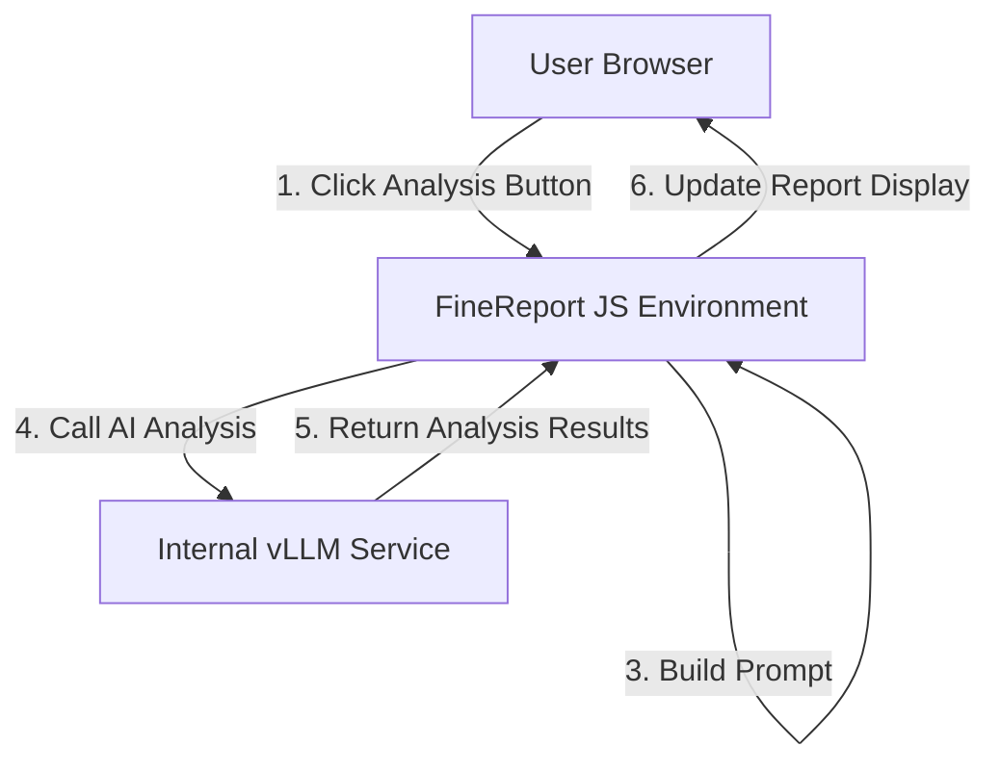

# AI 集成帆软报表框架 (AIDA Watchboard)

本项目旨在将 AI 分析能力集成到帆软报表(FineReport)系统中，通过 JavaScript 模块调用内部 vLLM 服务(DeepSeek)，实现对报表数据的智能分析和洞察，为用户提供更加智能化的数据分析体验。

## 项目概述

系统架构由以下几个主要部分组成：

1. **用户浏览器层**：用户通过浏览器访问帆软报表界面，与报表进行交互。
2. **帆软报表 JS 环境**：包含内嵌的 AI 分析 JS 模块和帆软 JS API。
3. **公司内网**：部署了内部 vLLM 服务(DeepSeek)，提供 OpenAI 兼容的 API 接口。

## 交互流程

1. 用户在帆软报表界面点击"AI 分析"按钮
2. JS 模块调用帆软 API 获取当前报表数据
3. JS 模块构造 Prompt，通过 fetch()向 vLLM 服务发起 POST 请求
4. LLM 处理请求并返回分析结果(JSON 格式)
5. JS 模块解析结果，调用帆软 API 将分析内容更新到报表控件中

## 目录结构

```plaintext
/AIDA_Watchboard/
├── src/                              # 源代码目录
│   ├── core/                         # 核心功能模块
│   │   ├── ai-analyzer.js            # AI分析模块
│   │   ├── data-collector.js         # 数据收集模块
│   │   ├── prompt-builder.js         # Prompt构建模块
│   │   └── result-processor.js       # 结果处理模块
│   ├── config/                       # 配置文件
│   │   ├── api-config.example.js     # API配置模版，使用时复制到api-config.js
│   │   └── prompt-templates.js       # Prompt模板
│   ├── ui/                           # UI相关模块
│   │   ├── loading-indicator.js      # 加载指示器
│   │   └── message-box.js            # 消息框
│   ├── integration/                  # 帆软报表集成模块
│   │   └── fr-api-wrapper.exmaple.js # 帆软API封装
│   └── main.js                       # 主入口文件
├── examples/                         # 示例代码
│   ├── integration-example.js        # 集成示例代码
│   └── integration-example.html      # 集成示例HTML
├── docs/                             # 文档
│   ├── AI Integrated FineReport Framework.html  # 系统架构图
│   └── development.md                # 开发指南
├── tests/                            # 测试文件
│   ├── mock-data/                    # 模拟数据
│   │   └── sample-report-data.js     # 示例报表数据
│   └── test-ai-analyzer.js           # AI分析测试
└── README.md                         # 项目说明
```

## 使用方式

### 1. 在帆软报表中集成

在帆软报表中，可以通过以下方式使用该模块：

1. 将整个项目部署到帆软报表服务器的适当位置
2. 在报表模板的 HTML 页面中引入框架：

```html
<script type="module" src="/path/to/AI_FineReport_Dashboard/src/main.js"></script>
```

3. 在报表的自定义 JS 代码中初始化框架

```javascript
// 初始化框架
window.AIDA_Watchboard.init({
  api: {
    url: "http://internal-vllm-service.company.com/v1/chat/completions",
    apiKey: "YOUR_API_KEY",
    model: "deepseek-ai/DeepSeek-R1-Distill-Qwen-14B",
    systemPrompt: "此处填写系统级指令",
    temperature: 0.3,
    maxTokens: 2000,
  },
});
// 为分析按钮添加点击事件
const analysisButton = document.getElementById("ai-analysis-button");
analysisButton.addEventListener("click", async function () {
  await window.AIDA_Watchboard.runBasicAnalysis();
});
```

## 开发指南

### 环境准备

1. 确保已安装 Node.js 环境
2. 克隆项目到本地
3. 安装依赖：`npm install`

### 修改配置

根据实际环境修改 `src/config/api-config.js` 中的 API 配置：

```javascript
const defaultAPIConfig = {
  url: "http://your-vllm-service-url/v1/chat/completions",
  apiKey: "YOUR_API_KEY",
  model: "your-model-name",
  // 其他配置...
};
```

### 自定义 Prompt 模板

可以在 `src/config/prompt-templates.js` 中自定义分析 prompt 模板。

### 适配帆软报表

根据实际的帆软报表环境，修改 `src/integration/fr-api-wrapper.js` 中的组件 ID 和 API 调用方式。

更多详细的开发指南请参考 [development.md](./docs/development.md) 文件。

## 架构图



详细的系统架构图请参考 [AI Integrated FineReport Framework.html](./docs/AI%20Integrated%20FineReport%20Framework.html) 文件。

## 注意事项

- 确保内部 vLLM 服务可正常访问
- 注意数据安全，避免敏感信息泄露
- 根据实际帆软报表版本调整 API 调用方式
- 大型报表数据可能需要进行预处理，避免超出 token 限制

## 许可证

本项目采用 MIT 许可证。详情请参阅 [LICENSE](./LICENSE) 文件。
