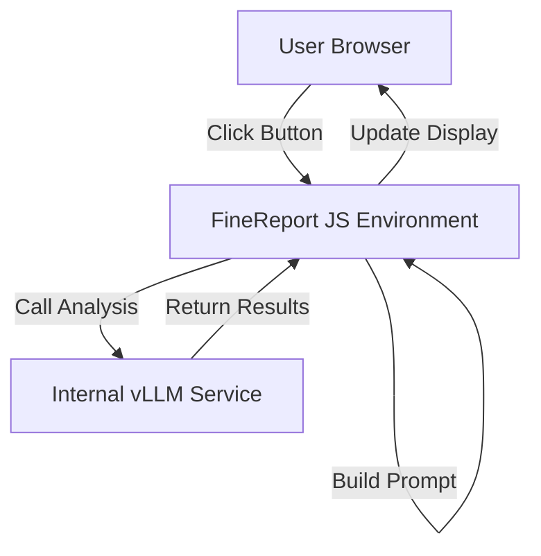

# AI 集成帆软报表框架 (AIDA Watchboard)

**版本：0.0.1-alpha** | **测试覆盖率：94.31%** | **测试套件：7 个** | **测试用例：52 个**

本项目旨在将 AI 分析能力集成到帆软报表(FineReport)系统中，通过 JavaScript 模块调用内部 vLLM 服务(DeepSeek)，实现对报表数据的智能分析和洞察，为用户提供更加智能化的数据分析体验。

## 项目状态

🚀 **当前版本**: 0.0.1-alpha (开发阶段)

✅ **核心功能已完成**:

- AI 分析引擎和数据处理
- 聊天交互系统
- 性能监控和仪表盘
- 帆软报表集成接口
- 完整的单元测试覆盖

🔧 **开发中**:

- UI 模块测试完善
- 集成测试和端到端测试
- 性能优化

📋 **计划功能**:

- 更多报表数据类型支持
- 高级分析模板
- 用户配置界面

## 项目概述

系统架构由以下几个主要部分组成：

1. **用户浏览器层**：用户通过浏览器访问帆软报表界面，与报表进行交互。
2. **帆软报表 JS 环境**：包含内嵌的 AI 分析 JS 模块和帆软 JS API。
3. **公司内网**：部署了内部 vLLM 服务(由集团部署托管的 DeepSeek R1)，提供 OpenAI 兼容的 API 接口。

## 功能特点

1. **AI 分析集成**：一键启动 AI 分析，获取报表数据的深度洞察
2. **上下文信息增强**：支持表格、图表、交叉表、仪表盘和地图数据的提取和分析，提供更丰富的上下文信息
3. **流式响应**：支持流式响应，提供更好的用户体验
4. **性能监控**：内置性能监控功能，跟踪 AI 分析的性能指标
5. **交互式聊天**：提供可拖拽、可调整大小的聊天窗口，支持 Markdown 格式显示，方便用户与 AI 助手交流

## 交互流程

1. 用户在帆软报表界面点击"AI 分析"按钮
2. JS 模块调用帆软 API 获取当前报表数据
3. JS 模块构造 Prompt，通过 fetch()向 vLLM 服务发起 POST 请求
4. LLM 处理请求并返回分析结果(JSON 格式)
5. JS 模块解析结果，调用帆软 API 将分析内容更新到报表控件中

## 目录结构

```plaintext
/AI_FineReport_Dashboard/
├── src/                              # 源代码目录
│   ├── core/                         # 核心功能模块
│   │   ├── ai-analyzer.js            # AI分析模块
│   │   ├── chat-manager.js           # 聊天管理模块
│   │   ├── chat-prompt-builder.js    # 聊天提示构建模块
│   │   ├── data-collector.js         # 数据收集模块
│   │   ├── performance-monitor.js    # 性能监控模块
│   │   ├── prompt-builder.js         # Prompt构建模块
│   │   ├── result-processor.js       # 结果处理模块
│   │   └── __tests__/                # 核心模块单元测试
│   │       ├── chat-manager.test.js        # 聊天管理模块测试
│   │       ├── chat-prompt-builder.test.js # 聊天提示构建模块测试
│   │       ├── data-collector.test.js      # 数据收集模块测试
│   │       ├── performance-monitor.test.js # 性能监控模块测试
│   │       ├── prompt-builder.test.js      # Prompt构建模块测试
│   │       └── result-processor.test.js    # 结果处理模块测试
│   ├── config/                       # 配置文件
│   │   ├── __tests__/                # 配置模块单元测试
│   │   │   └── prompt-templates.test.js    # Prompt模板测试
│   │   ├── api-config.example.js     # API配置模版
│   │   ├── api-config.js             # API配置文件
│   │   └── prompt-templates.js       # Prompt模板
│   ├── ui/                           # UI相关模块
│   │   ├── chat-styles.js            # 聊天窗口样式
│   │   ├── chat-window.js            # 聊天窗口组件
│   │   ├── loading-indicator.js      # 加载指示器
│   │   ├── message-box.js            # 消息框
│   │   ├── performance-dashboard.js  # 性能监控仪表盘
│   │   └── styles.js                 # 通用样式
│   ├── integration/                  # 帆软报表集成模块
│   │   ├── fr-api-wrapper.example.js # 帆软API封装示例
│   │   ├── fr-api-wrapper.js         # 帆软API封装
│   │   └── fr-chat-integration.js    # 聊天功能集成
│   ├── __mocks__/                    # 测试模拟文件
│   │   ├── config/                   # 配置模块模拟
│   │   ├── core/                     # 核心模块模拟
│   │   └── ui/                       # UI模块模拟
│   └── main.js                       # 主入口文件
├── examples/                         # 示例代码
│   ├── integration.example.html      # 集成示例HTML
│   └── integration.example.js        # 集成示例代码
├── docs/                             # 文档
│   └── development.md                # 开发指南
├── dist/                             # 构建输出目录
├── coverage/                         # 测试覆盖率报告
├── jest.config.js                    # Jest测试配置
├── jest.setup.js                     # Jest测试环境设置
├── rollup.config.js                  # Rollup构建配置
├── babel.config.cjs                  # Babel转译配置
└── README.md                         # 项目说明
```

## 测试覆盖率

项目采用 Jest 测试框架，具有完善的单元测试覆盖。当前测试覆盖率：

- **总体覆盖率**: 94.31%
- **测试套件**: 7 个测试套件，52 个测试用例
- **核心模块覆盖率**:
  - `chat-prompt-builder.js`: 100% (行覆盖率)
  - `data-collector.js`: 100% (行覆盖率)
  - `prompt-builder.js`: 100% (行覆盖率)
  - `performance-monitor.js`: 99.56% (行覆盖率)
  - `chat-manager.js`: 94.86% (行覆盖率)
  - `result-processor.js`: 82.99% (行覆盖率)
  - `prompt-templates.js`: 96.73% (行覆盖率)

### 运行测试

```bash
# 运行所有测试
npm test

# 运行测试并生成覆盖率报告
npm test -- --coverage

# 运行特定测试文件
npm test -- src/core/__tests__/performance-monitor.test.js
```

### 测试结构

- **核心模块测试** (`src/core/__tests__/`): 测试所有核心功能模块
- **配置模块测试** (`src/config/__tests__/`): 测试配置和模板功能
- **模拟文件** (`src/__mocks__/`): 为测试提供模拟依赖
- **测试环境配置**:
  - `jest.config.js`: Jest 主配置文件
  - `jest.setup.js`: 测试环境初始化
  - `babel.config.cjs`: Babel 转译配置

## 使用方式

### 1. 在帆软报表中集成

在帆软报表中，可以通过以下方式使用该模块：

1. 将整个项目部署到帆软报表服务器的适当位置
2. 在报表模板的 HTML 页面中引入框架：

```html
<script type="module" src="/path/to/AI_FineReport_Dashboard/src/main.js"></script>
```

3. 在报表的自定义 JS 代码中初始化框架

```javascript
// 初始化框架
window.AIDA_Watchboard.init({
  api: {
    url: "http://internal-vllm-service.company.com/v1/chat/completions",
    apiKey: "YOUR_API_KEY",
    model: "deepseek-ai/DeepSeek-R1-Distill-Qwen-14B",
    systemPrompt: "此处填写系统级指令",
    temperature: 0.3,
    maxTokens: 2000,
  },
  // 聊天功能配置
  enableChat: true, // 是否启用聊天功能，默认为true
  chat: {
    // 聊天相关配置
    // 注意：enableDefaultAnalysis选项只能在后端设置，不能从前端配置获取
    // 默认为true，IT管理员可以通过修改main.js中的代码来更改此设置
  },
});
// 为分析按钮添加点击事件
const analysisButton = document.getElementById("ai-analysis-button");
analysisButton.addEventListener("click", async function () {
  await window.AIDA_Watchboard.runBasicAnalysis();
});

// 显示聊天窗口
window.AIDA_Watchboard.showChatWindow();
```

### 2. 流式响应特性

本框架默认启用流式响应（Stream Response）特性，这意味着：

- AI 分析结果会实时显示在界面上，无需等待完整分析完成
- 用户可以立即看到分析进展，提升交互体验
- 对于复杂数据集的分析，减少了用户等待时间的感知

流式响应已内置于框架核心，使用`runBasicAnalysis()`时会自动启用，无需额外配置。

### 3. 性能监控仪表盘

本框架内置了性能监控功能，可以帮助您跟踪和优化 AI 分析的性能：

- **实时统计**：跟踪总请求数、成功率、平均响应时间等关键指标
- **模型性能**：监控不同模型的性能表现，包括请求数、成功率和响应时间
- **Token 使用情况**：统计 Prompt 和 Completion 的 Token 使用量及估算成本
- **缓存效率**：监控缓存命中率，优化系统性能
- **请求历史**：查看最近的请求记录，包括详细的请求参数和结果

使用方法：

```javascript
// 显示性能监控仪表盘
window.AIDA_Watchboard.showPerformanceDashboard("dashboard-container", "admin");

// 获取性能数据
const performanceData = window.AIDA_Watchboard.getPerformanceData();

// 重置性能数据
window.AIDA_Watchboard.resetPerformanceData();

// 配置性能监控
window.AIDA_Watchboard.configurePerformanceMonitor({
  enabled: true,
  maxRecentRequests: 20,
  persistData: true,
});

// 配置仪表盘显示
window.AIDA_Watchboard.configureDashboard({
  refreshInterval: 10000,
  showModelDetails: true,
  showTokenUsage: true,
  showRecentRequests: true,
  maxRecentRequests: 15,
});
```

## 安装和构建

### 环境准备

1. 确保已安装 Node.js 环境
2. 克隆项目到本地
3. 安装依赖：`npm install`

### 构建项目

本项目使用 Rollup 进行打包，提供以下 npm 脚本：

```bash
# 开发模式（监视文件变化并实时构建）
npm run dev

# 生产构建
npm run build

# 代码规范检查
npm run lint

# 运行测试
npm test
```

构建后的文件将输出到`dist`目录，主要包括：

- `ai-integrated-fr.esm.js`：ES 模块格式的主文件

## 测试

项目包含针对核心模块的单元测试，以确保代码质量和功能稳定性。测试覆盖了以下主要模块：

- `performance-monitor.js`: 监控 AI 分析的性能指标。
- `prompt-builder.js`: 构建发送给 AI 模型的提示。
- `result-processor.js`: 处理和解析 AI 模型的响应结果。

运行测试请参见“安装和构建”部分的说明。

## 开发指南

详细的开发指南请参见 [docs/development.md](docs/development.md)。

### 修改配置

根据实际环境修改 `src/config/api-config.js` 中的 API 配置：

```javascript
const defaultAPIConfig = {
  url: "http://your-vllm-service-url/v1/chat/completions",
  apiKey: "YOUR_API_KEY",
  model: "your-model-name",
  // 其他配置...
};
```

### 自定义 Prompt 模板

可以在 `src/config/prompt-templates.js` 中自定义分析 prompt 模板。

### 适配帆软报表

根据实际的帆软报表环境，修改 `src/integration/fr-api-wrapper.js` 中的组件 ID 和 API 调用方式。

## 架构图



## API 参考

框架提供以下主要 API：

### 核心 API

```javascript
// 初始化框架
init(config);

// 执行基础AI分析
runBasicAnalysis(options);

// 使用流式响应执行AI分析
runStreamAnalysis(options, resultContainerId);

// 配置API参数
configureAPI(config);
```

### 性能监控 API

```javascript
// 获取性能数据
getPerformanceData();

// 重置性能数据
resetPerformanceData();

// 配置性能监控
configurePerformanceMonitor(options);

// 显示性能监控仪表盘
showPerformanceDashboard(containerId, role);

// 配置仪表盘显示
configureDashboard(options);
```

### 聊天功能 API

```javascript
// 显示聊天窗口
showChatWindow();

// 隐藏聊天窗口
hideChatWindow();

// 切换聊天窗口显示状态
toggleChatWindow();

// 获取聊天历史
getChatHistory();

// 清除聊天历史
clearChatHistory();
```

## 注意事项

- 确保内部 vLLM 服务可正常访问
- 注意数据安全，避免敏感信息泄露
- 根据实际帆软报表版本调整 API 调用方式
- 大型报表数据可能需要进行预处理，避免超出 token 限制

## 许可证

本项目采用 MIT 许可证。详情请参阅 [LICENSE](./LICENSE) 文件。
